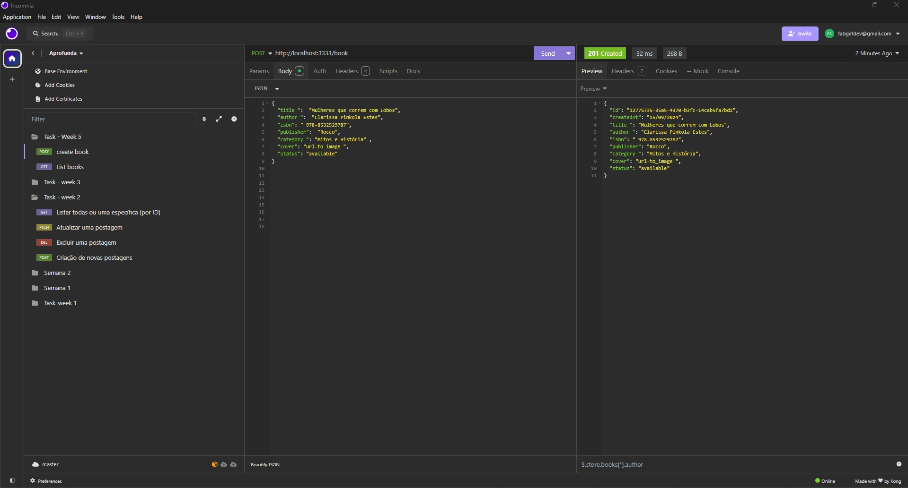
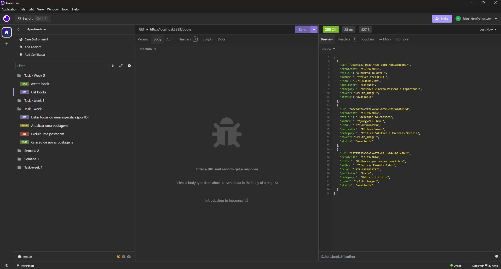
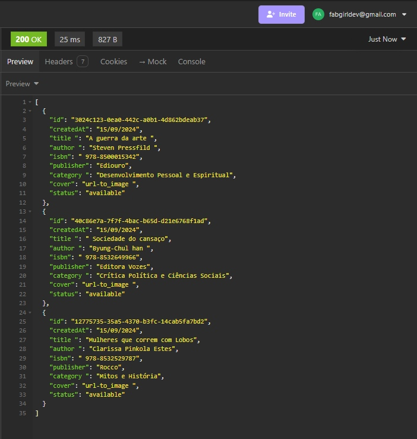

# Tarefa Semana 5 - Criação da API para Adotar Clean Architecture

## Descrição
Este projeto faz parte da Tarefa da Semana 5, onde o objetivo é implementar uma API seguindo os princípios de Clean Architecture. A API permite a criação de livros e a listagem de todos os livros cadastrados.

### Requisitos da Tarefa:
- Deve ser possível criar um livro;
- Deve ser possível listar todos os livros;
- Entrega: Link do repositório gerado a partir do template com seus commits.

### Principais Tecnologias Utilizadas: 🚀
1. Node.js;
2. TypeScript;
3. Postman para testes das rotas.

### Funcionalidades: 
- Criar um livro
- Listar todos os livros

### Testes Realizados no Insomnia: 🧪
Criação de um livro: ⏬

Listagem de todos os livros criados - imagem 1: ⏬

Listagem de todos os livros criados - imagem 2: ⏬

## O que Estudei Esta Semana:  📚🤓💻
Durante esta semana, na formação Aprofunda PretaLab, estudamos TypeScript, Testes Unitários e os princípios da Arquitetura Limpa, aprendendo como refatorar e organizar o código de forma modular e escalável, separando responsabilidades para melhorar a estrutura e facilitar futuras manutenções.